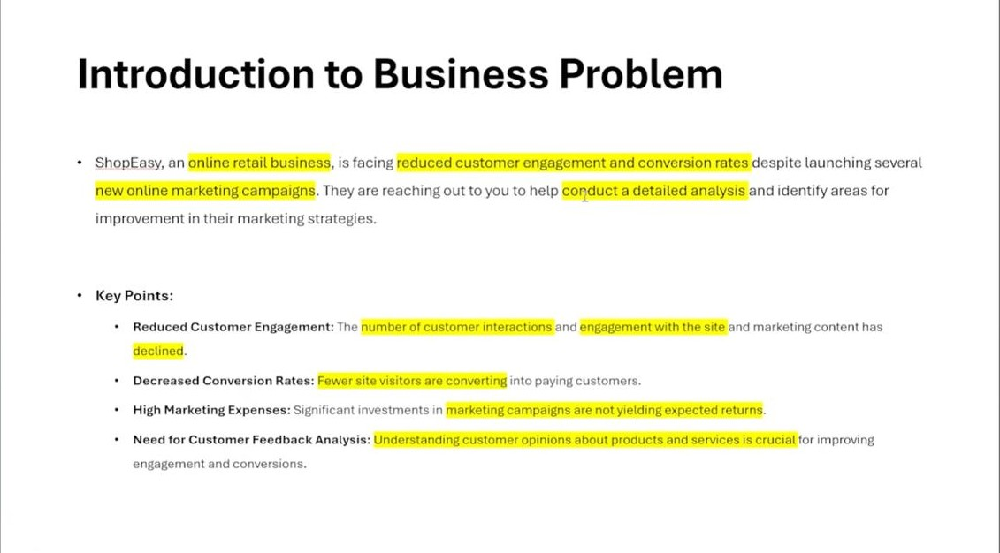
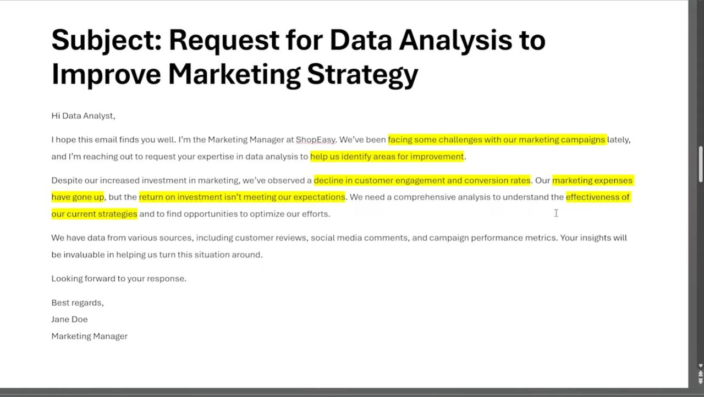
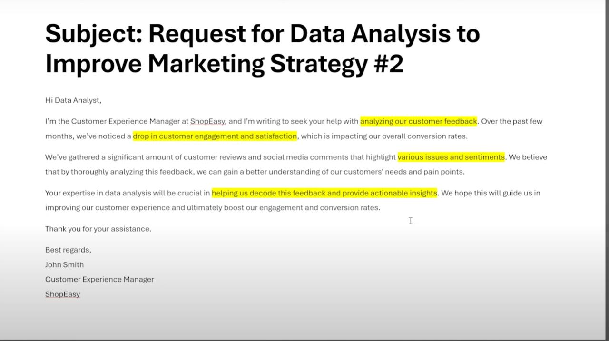
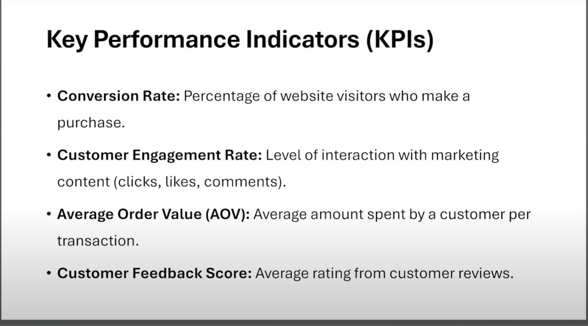
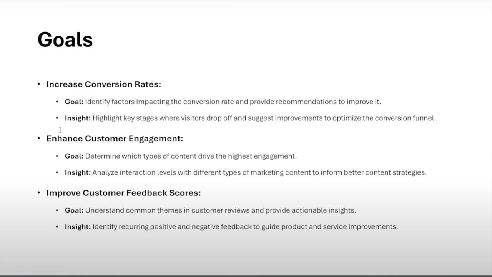
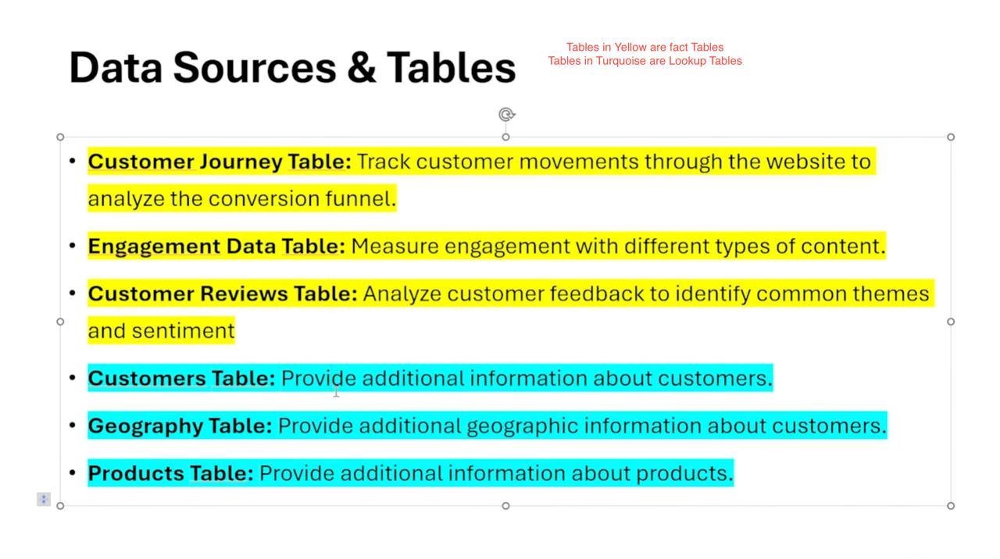
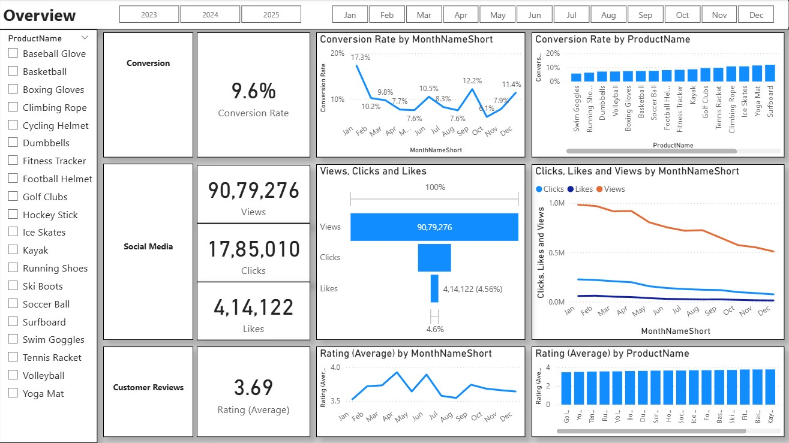

# 📊 Multi-Platform Marketing Insights Dashboard | Power BI Project

---

## 🧠 Project Overview

This portfolio project was designed to help the marketing and customer experience teams at **ShopEasy** understand key customer behavior metrics like **conversion rates**, **engagement**, and **review sentiment**.

The dashboard was built using data extracted and cleaned in **SQL Server**, enhanced with **Python-based sentiment analysis**, and finally visualized in an interactive **Power BI** dashboard.

---

## 🎯 Business Goals

- Improve conversion by identifying bottlenecks in the customer journey  
- Understand customer sentiment across reviews to refine product offerings  
- Discover which marketing channels and platforms generate the most engagement  
- Enable non-technical stakeholders to explore the data dynamically  

---

## 🧩 Problem Statements & Team Request

The business problem was communicated via internal documentation and emails, summarized below:

  
  
  
  
  
  

---

## 🛠 Tools & Technologies Used

| Tool                | Purpose                                                        |
|---------------------|----------------------------------------------------------------|
| **SQL Server (SSMS)** | Data cleaning, transformation, joins, and metrics             |
| **Python (VS Code)**  | Sentiment analysis using NLTK (VADER)                         |
| **Power BI Desktop**  | Interactive dashboard development with DAX and slicers        |

---

## 📁 Data Workflow

1. **Extracted** raw data from SQL Server:
   - `fact_customer_journey`
   - `fact_customer_reviews`
   - `dim_customers`
   - `dim_products`

2. **Cleaned & joined** data in SSMS with SQL queries

3. **Performed sentiment analysis** in Python using VADER (NLTK):
   - Generated `SentimentScore`, `SentimentCategory`, `SentimentBucket`
   - Saved to CSV for visualization in Power BI

4. **Built and published** dashboard in Power BI

---

## 🧮 Key KPIs Tracked

- Conversion Rate  
- Engagement Rate  
- Average Order Value  
- Social Media Click-throughs  
- Sentiment Buckets and Review Categories  
- Funnel Drop-off Stages  

---

## 📊 Dashboard Pages

### 1. **Overview Page**
**Goal:** High-level KPIs and overall summary

---

### 2. **Conversion Details**
**Goal:** Understand conversion funnel and drop-offs

---

### 3. **Social Media Details**
**Goal:** Engagement by platform and content type

---

### 4. **Customer Review Details**
**Goal:** Sentiment analysis insights from customer reviews

---

## 🔍 Key Insights

- Most customers dropped off at the product view stage — indicating issues in the product page layout or pricing  
- Video content had the highest engagement on social media  
- Negative reviews mostly revolved around shipping delays, not the product itself  
- Mixed sentiment categories show opportunities for targeted support campaigns  

---

## ✅ Outcome

This project successfully:

- Delivered an end-to-end analytics solution (SQL → Python → Power BI)  
- Helped the marketing team refocus on high-performing channels  
- Provided clear visual storytelling for non-technical business users  
- Demonstrated full-stack data analytics and BI development capabilities  
---

## 🙏 Credits & Acknowledgements

This project is inspired by and built using resources provided by **Ali Ahmad**.

Special thanks to [Ali Ahmad's YouTube Channel](https://www.youtube.com/@aliahmaddata) for:
- The original dataset and business problem statement  
- SQL database backup files used for the project  

> 📺 Check out his amazing tutorials and datasets on [@aliahmaddata](https://www.youtube.com/@aliahmaddata)

---

## 📬 Contact

**Shashank Pokala**  
Data Analyst / Front-End Developer  
[LinkedIn](https://www.linkedin.com/in/shashank-r-pokala/) • [GitHub](https://github.com/Sha1Pokala)
